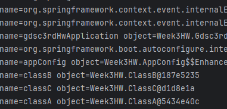
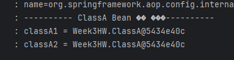

기초 백엔드 스터디 3주차
===
***
## Spring Bean
> 스프링 IoC 컨테이너에 의해 관리되는 자바 객체.

### 스프링 IoC 컨테이너

ApplicationContext라는 인터페이스가 IoC 컨테이너를 대표하며, ApplicationContext는 여러 인터페이스를 상속받아 만들어진다.
~~~java
@Test
void findAllBean(){
    String[] beanDefinitionNames = applicationContext.getBeanDefinitionNames();
    for (String beanDefinitionName : beanDefinitionNames) {
        Object bean = applicationContext.getBean(beanDefinitionName);
        log.info("name=" + beanDefinitionName + " object=" + bean);
    }
}
~~~
위 코드는 ApplicationContext를 이용하여 모든 Bean을 조회하는 코드이며, 이 외에도 이벤트 발행, 환경변수 조회 등 Bean에 대한 다양한 작업을 수행할 수 있다.

### 빈 스코프
> 빈이 생성되고 존재하는 범위를 지정하는 것

스코프의 종류
- 싱글톤 : 기본 스코프로, 스프링 컨테이너의 시작과 종료까지 유지되는 가장 넓은 범위의 스코프. 별다른 설정을 하지 않으면 내부에서 생성하는 Bean 오브젝트는 모두 싱글톤으로 만들어진다.

- 프로토타입 : 프로토타입 Bean의 생성과 의존관계 주입까지만 관여하는 매우 짧은 범위의 스코프

- 웹 관련 스코프
  - request : 웹 요청이 들어오고 나갈 때 까지 유지되는 스코프
  - session : 웹 세션이 생성되고 종료될 때 까지 유지되는 스코프
  - application : 웹의 서블릿 컨텍스트와 같은 범위로 유지되는 스코프
  
~~~java
@Scope("prototype")
@Component
public class Prototype {
	...
}
~~~
**@Scope** 어노테이션을 통해 지정할 수 있다.
### 싱글톤의 단점
>*종합적으로 유연성이 떨어진다*
1. 다형성을 이용하지 못한다.\
싱글톤 패턴을 사용하면 생성자의 접근 지정자를 private으로 설정해야 한다. 이 경우 객체의 상속이 불가능해져 객체지향의 이점인 다형성을 적용할 수 없다.

2. 안정성이 중요한 어플리케이션에서 필수적인 단위 테스트가 어렵다.\
싱글톤 패턴으로 구현한 객체는 공유 객체가 되어 단위테스트를 실행할 때 테스트 순서에 따라 결과가 달라진다.

3. 의존관계상 클라이언트가 구체 클래스에 의존하여 DIP를 위반한다.

4. 클라이언트가 구체 클래스에 의존해서 OCP원칙을 위반할 가능성이 높다.

5. 내부 속성을 변경하거나 초기화 하기 어렵다.

6. private 생성자로 자식 클래스를 만들기 어렵다.

### 스프링의 싱글톤
스프링은 싱글톤 패턴을 사용한다. 애플리케이션이 시작 될 때, 인스턴스를 메모리에 딱 하나 할당하고 뒤의 호출 할 때마다 해당 인스턴스를 반환하는 디자인 패턴이다.

이를 적용하면 이미 만들어진 객체를 공유해서 효율적인 사용이 가능해 지는데, 이를 위해 스프링에서는 IoC 컨테이너를 사용한다.

이를 이용하면 싱글톤 패턴의 모든 단점을 해결하면서 객체를 싱글톤으로 유지할 수 있다.

### 빈과 의존성 주입
의존성을 주입한다고 하면 어디에선가 new키워드를 사용하여 객체를 생성해야 한다.
~~~java
public class Service {
		private final Dao dao;

		public Service(Dao dao) {
				this.dao = dao;
		}
}
~~~
~~~java
Service service = new Service(new JdbcDao());
~~~
예시 코드를 보면 Service의 생성자로 Dao 구현체를 생성하여 넣어주고 있다.

##### *만약 Dao의 구현체가 바뀐다면?*
Service를 생성할 때 Dao를 초기화함과 동시에 어떤 Dao의 구현체를 선택할 것인지에 대한 책임도 있기 때문에 Service를 생성하는 곳에서도 변경이 일어난다.
~~~java
LineService lineService = new LineServie(new StationsDao(), new LineDao(), new SectionDao());
~~~
또한, 의존성을 주입할 때 여러 개의 의존성이 필요하다면 해당 **의존성 주입 순서**를 알아야 한다.\
직접 의존성을 주입하기 위해서는
1. 의존 관계를 모두 파악해야 하며
2. 많은 객체가 중복 생성되므로

의존성 주입이 필요한 객체를 **Bean으로 등록**하여 스프링 IoC 컨테이너가 객체의 생성과 의존성 주입을 관리하도록 해야한다.

### 스프링 IoC 컨테이너의 빈 관리 방법
>IoC컨테이너가 Bean의 라이프 사이클을 관리하는 과정
1. 객체 생성 + property 설정
스프링 IoC 컨테이너가 생성이 되면, Bean 스코프가 싱글톤인 객체를 생성한다.\
이 때 Bean으로 등록하기 위해서 다양한 Configuration 메타데이터를 이용하여 통일된 Bean Definition을 생성한다.\
그리고 빈으로 등록할 POJO와 Bean Definition정보를 사용하여 빈을 생성한다.\
이 과정에서 싱글톤 패턴을 사용하는 것이 아닌 평범한 자바 클래스를 이용하여 객체를 생성한다.

2. 의존 설정\

Bean 객체가 생성되면 IoC 컨테이너는 의존 설정을 하며, 이 때 의존성 자동 주입이 일어나게 된다.

3. 객체 초기화 -> 사용 -> 소멸

사용 전에 초기화 과정이 필요한 객체들은 초기화 과정을 진행한다. 초기화가 끝나면 빈을 사용할 수 있게 되며 스프링 컨테이너가 종료 될 때 Bean 스코프가 싱글톤인 객체들도 함께 소멸된다.

## Spring Bean 등록 방법
> **@Bean**과 **@Configuration** 어노테이션을 사용하고, **@Configuration** 어노테이션을 사용한 객체를 **ApplicationContext**의 파라미터로 넘긴다.
~~~java
@Configuration
public class Appconfig {
    @Bean
    public BeanA beanA() {
        return new BeanA();
    }

    @Bean
    public BeanB beanB() {
        return new BeanB(beanA());
    }

    @Bean
    public BeanC beanC() {
        return new BeanC(beanA());
    }
}
~~~
**@Bean** 어노테이션을 사용하여 빈으로 등록하고 **@Configuration** 어노테이션을 사용해 빈을 싱글톤으로 관리한다. **@Configuration**을 사용하면 스프링이 바이트 코드를 조작해 싱글톤이 보장되도록 다른 객체를 생성해 저장한다.
~~~java
@Test
void singleton(){
    ApplicationContext ac = new AnnotationConfigApplicationContext(Appconfig.class);

    BeanA beanA1 = ac.getBean("beanA",BeanA.class);
    BeanA beanA2= ac.getBean("beanA",BeanA.class);

    log.info("beanA1 = " + beanA1);
    log.info("beanA2 = " + beanA2);

    assertThat(beanA1).isSameAs(beanA2);
}
~~~
다음 Appconfig를 ApplicationContext의 구현체 AnnotationConfigApplicationContext에 파라미터로 넘겨 스프링 빈으로 등록한다.\
위 코드에서는 Appconfig.class를 파라미터로 넘겼으므로, AppConfig와 해당 파일에 빈으로 등록한 것들이 스프링 빈으로 등록된다.

### 빈 설정 시 주의점
1. 싱글톤 스코프의 Bean이 상태를 가지면 안된다.

예를 들어 싱글톤 스코프의 빈이 Value라는 상태를 가질 때 Thread1은 Value의 값을 증가 시킨다고 가정해보자. 그리고 Thread2는 Value라는 값을 가져와 사용한다고 하면 Thread2는 매번 다른 값을 사용할 수 있다. 해당 Bean의 상태가 가변적이기 때문에 의도한 결과가 나온다는 보장이 없다. 그러므로 빈 스코프는 싱글톤으로 설정할 경우 상태를 가지면 안된다. 

2. 의존성을 자동 주입해야 할 인터페이스의 구현체가 두 개 이상일 경우
~~~java
@Repository
public class StationInMemoryStationDao implements StationDao {
}
~~~
~~~java
@Repository
public class StationJdbcStationDao implements StationDao {
}
~~~
~~~java
@Service
public class StationService {

		private final StationDao stationDao;

		public StationService(final StationDao stationDao) {
				this.stationDao = stationDao;
		}
}
~~~
의존성을 자동 주입해야 할 인터페이스의 구현체가 두 개 이상이라면 스프링은 어떤 구현체를 자동 주입할 지 정하지 못해 충돌이 일어난다.\
이럴 경우 **@Primary**와 **@Qualifier** 어노테이션을 사용해 의존성 주입 우선순위를 정하도록 하자.

### **@Component**
> 빈 개수가 많아지면 개발자가 누락할 가능성이 있기 때문에 **@Component**를 사용하여 간단하게 스프링 빈 등록을  할 수 있다.
- **Component Scan**\
스프링이 애플리케이션의 클래스를 검색하고, 자동으로 스프링 빈을 등록하는 방법. 이런 방식으로 빈을 자동으로 구성해 애플리케이션의 구성 및 설정을 간소화 할 수 있다.\
    >**@ComponentScan**, **@Component** 어노테이션 사용

- **@Component**\
스프링 빈으로 등록하려는 클래스에 붙일 수 있는 어노테이션. 스프링이 **@Componet**가 붙은 클래스를 자동으로 검색하고 빈으로 등록한다.
    ~~~java
    @Component
    public class BeanA {
        ...
    }
    
    @Component
    public class BeanB {
        ...
    }
    
    @Component
    public class BeanC {
        ...
    }
    ~~~
    *위의 예시 코드에서 사용한 클래스들에 **@Component**를 붙인 모습*
    ~~~java
    public class AutoAppconfig {}
    ~~~
    ~~~java
    AnnotationConfigApplicationContext applicationContext 
            = new AnnotationConfigApplicationContext(AutoAppconfig.class);
    ~~~
  하지만 이렇게 구현할 경우 **@Component** 를 붙인 클래스를 스프링이 찾지 못해 다음에 설명할 **@ComponentScan**을 사용한다.

- **Component Scan**\
**@ComponentScan** 어노테이션을 사용하여 스프링이 어느 패키지에서 클래스 검색을 시작할 지 및 검색할 패키지의 범위를 지정할 수 있다.
    ~~~java
  @ComponentScan
    public class AutoAppconfig {}
    ~~~
  **@ComponentScan**로 검색할 패키지의 범위를 지정할 수 있는데, 기본적으로 **@ComponentScan**가 붙은 설정 정보 클래스의 패키지가 시작 위치가 된다.
  
  다음과 같은 파일 구조를 가지기 때문에 BeanA, BeanB, BeanC 클래스는 **@ComponentScan**의 대상이 되고 Bean으로 등록이 되는 것을 볼 수 있다.\
  이 때 등록된 Bean은 싱글톤이다.

## Component Scan을 이용하여 ClassB, ClassC를 빈 등록

## ClassA를 싱글톤 빈으로 등록
