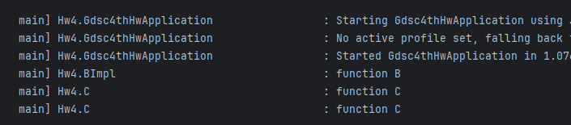

기초 백엔드 스터디 4주차
===
***
## DI(Dependency Injection)
> 외부에서 두 객체 간의 관계를 결정해주는 디자인 패턴
>> 한 객체가 다른 객체를 사용할 때 의존성이 있다고 할 수 있고, 의존 관계가 존재한다면 한 클래스가 바뀔 때 다른 클래스가 영향을 받을 수 있다

인터페이스를 사이에 두어
1. 클래스 레벨에서는 의존관계가 고정되지 않도록 하고,

2. 런타임 시에 관꼐를 동적으로 주입하여 유연성을 확보하고 결합도를 낮출 수 있게 해준다.

의존관계 주입 방법은 크게 4가지로 나눌 수 있다.
1. 생성자 주입

2. 수정자 주입(setter 주입)

3. 필드 주입

4. 일반 메서드 주입
#### **@Autowired** 어노테이션
스프링의 여러가지 의존성 주입 중에서 가장 간편하게 쓰이는 방법으로, **@Autowired** 어노테이션을 붙이게 되면 Spring이 자동으로 해당 클래스의 객체를 찾아 필요한 의존성을 주입해 준다.
~~~java
@Component
public class Pizza {
    @Autowired
    private Cheese cheese;
}
~~~
다만, 위 코드의 Cheese도 Spring Bean 이어야 한다.
### 생성자 주입
> 생성자를 사용해 의존 관계를 주입하는 방법. 객체의 최초 생성 시점에 스프링이 의존성을 주입해준다.

주입받은 객체가 변하지 않거나 객체의 주입이 필요한 경우 강제하기 위해 사용할 수 있다.
* 스프링 프레임워크에서는 생성자가 1개만 있을 경우에 **@Autowired**을 생략해도 주입이 가능하도록 편의성을 제공한다.\
만약 **@Autowired**가 여러 생성자에 있을 경우 가장 많은 의존성을 주입할 수 있는 생성자를 사용해 의존성을 주입한다.
~~~java
@Component
public class Pizza {
    private Cheese cheese;
    private Bread bread;

    // @Autowired
    public Pizza(Cheese cheese, Bread bread) {
        this.cheese = cheese;
        this.bread = bread;
    }
}
~~~
### setter 주입
> setter 필드의 값을 변경하는 수정자 메서드를 통해 의존관계를 주입히는 방법.

선택, 변경 가능성이 있는 의존관계에 사용할 수 있다. setter메서드에 **@Autowired** 어노테이션을 붙이면 스프링이 setter를 사용해 자동으로 의존성을 주입해 준다.

이 때 빈 객체를 만들고 setter로 의존성을 주입해 주기 때문에 빈 생성자가 필요하기 때문에 파이널 필드(초기값이 저장되면 프로그램 종료까지 변하지 않는 것)를 만들 수 없고 의존성의 불변을 보장할 수 없다는 특징이 있다.
~~~java
@Component
public class Pizza {
    private Cheese cheese;
    private Bread bread;

    public void setCheese(Cheese cheese) {
        this.cheese = cheese;
    }

    public void setBread(Bread bread) {
        this.bread = bread;
    }
}
~~~
### 필드 주입
> **@Autowired** 어노테이션을 이용해 필드에 바로 주입하는 방법

필드 주입을 사용하게 되면 수동 의존성을 주입하고 싶어도 생성자와 setter가 없어 의존성이 프레임워크에 강하게 종속된다는 문제점이 있다.

따라서 애플리케이션의 실제 코드와 관계 없는 테스트 코드, 스프링 설정을 목적으로 하는 **@Configuration** 같은 곳에서만 특별한 용도로 사용해야한다.
~~~java
@Component
public class Pizza {
    @Autowired
    private Cheese cheese;
    @Autowired
    private Bread bread;
}
~~~
### 일반 메소드 주입
한번에 여러 필드를 주입할 수 있지만 잘 사용하지 않는다.
~~~java
@Component
public class Pizza {
    private Cheese cheese;
    private Bread bread;

    @Autowired
    public void init(Cheese cheese, Bread bread) {
        this.cheese = cheese;
        this.bread = bread;
    }
}
~~~
### DI 주의점
* **NullPointerException 방지**\
필드 주입이나 setter 주입을 할 때 스프링의 빈 관리 기능이 아닌 new 키워드로 객체를 생성할 경우, NullPointerException이 발생할 수 있다.
이들은 빈 생성자를 사용해 기본적으로 의존성이 없는 상태이기 때문이다.
하지만 생성자 주입은 (완전한 생성자라는 가정 하에) 객체 생성 시점에 모든 의존성을 주입해주므로 Null을 의도적으로 넣어주지 않는 한 NullPointerException이 발생할 수 없다.

* **순환참조 문제 방지**\
필드 주입이나 setter 주입을 통해 의존성을 주입하게 되면, A 객체가 B 객체를 의존함과 동시에 B 객체 또한 A 객체를 의존할 때 생기는 순환참조가 발생할 수 있다.
생성자 주입을 사용하는 객체들끼리의 의존성이 순환되면 스프링은 에러 메시지와 함께 프로그램을 종료한다.

### 주입 대상이 여러 개일 때
> 의존성 주입 우선순위는 다음과 같다.\
> 타입 -> **@Qualifier** -> **@Primary** -> 이름(변수명)
~~~java
@Component
public class Pizza {
    private Cheese cheese;
    private Bread bread;

    public Pizza(Cheese cheese, Bread bread) {
        this.cheese = cheese;
        this.bread = bread;
    }
}
~~~
~~~java
public interface Cheese {
}
~~~
~~~java
@Component
public class CheddarCheese implements Cheese{
}
~~~
~~~java
@Component
public class MozzarellaCheese implements Cheese{
}
~~~
Pizza에서 Cheese를 의존성 주입하고 싶지만 Bean에 Bean에 MozzarellaCheese 와 CheddarCheese 가 둘 다 등록되어 있어 어떤 것을 선택해야 할 지 알 수 없다.\
이 때 의존성 주입을 하는 순서는 다음과 같다.
1. 타입\
   CheddarCheese 와 MozzarellaCheese는 모두 Cheese의 구현체이므로 Cheese라는 타입으로 검색된다.
2. 이름\
   타입을 기준으로 여러 Bean이 검색되었다면 Bean의 이름을 기준으로 의존성을 주입한다.
    ~~~java
   @Component
    public class Pizza {
    private Cheese cheese;
    private Bread bread;
    
        public Pizza(Cheese cheddarCheese, Bread bread) {
            this.cheese = cheddarCheese;
            this.bread = bread;
        }
    }
    ~~~
   위 코드와 같이 생성자 매개변수명을 cheddarCheese로 바꿔준다면 자동으로 **CheddarCheese** Bean이 주입되고 생성에 성공하게 된다.

하지만 매개변수명을 바꿔 의존성을 주입해주게 된다면
1. 수동으로 **CheddarCheese**를 넣어줘야 하거나
2. 자동으로 주입해주려는 Bean을 바꿀 때

번거로워진다. 이럴 경우 **@Qualifier** 또는 **@Primary**를 이용하는 방법이 있다.
- **@Qualifier**
    ~~~java
    @Component
    @Qualifier("defaultCheese")
    public class MozzarellaCheese implements Cheese {
    }
    ~~~
    ~~~java
    @Component
    public class Pizza {
        private Cheese cheese;
        private Bread bread;
    
        public Pizza(@Qualifier("defaultCheese") Cheese cheese, Bread bread) {
            this.cheese = cheese;
            this.bread = bread;
        }
    }
    ~~~
  **@Qualifier** 어노테이션 안에 해당 Bean의 구분자를 지정해 줄 수 있다.\
  **MozzarellaCheese**에 붙어있는 **@Qualifier** 어노테이션을 **CheddarCheese**로 옮기면 **CheddarCheese**가 주입되게 된다.

- **@Primary**
    ~~~java
    @Component
    @Primary
    public class MozzarellaCheese implements Cheese {
    }
    ~~~
    ~~~java
    @Component
    public class Pizza {
    private Cheese cheese;
    private Bread bread;
    
        public Pizza(Cheese cheese, Bread bread) {
            this.cheese = cheese;
            this.bread = bread;
        }
    }
    ~~~
  **@Primary** 어노테이션이 붙은 Bean은 해당 타입으로 의존성 검색을 할 때 우선적으로 주입이 된다.\
일종의 기본 Bean이 되는 것이다.

### Lombok
> Java 라이브러리 중 하나로, 반복적인 코드를 줄이는 데 도움을 주는 어노테이션 기반의 도구를 제공해준다.

getter, setter, equals, hashCode 및 toString 메서드 등뿐만 아니라 생성자를 Lombok의 어노테이션을 사용하여 자동으로 생성할 수 있다.

다음은 Lombok이 제공하는 생성자로, DI방법 중 생성자 주입을 자동으로 설정해준다.

1. **@NoArgsConstructor** : 파라미터가 없는 기본 생성자를 생성
2. **@RequiredArgsConstructor** : final 또는 **@NonNull**로 표시된 필드만을 파라미터로 하는 생성자를 생성
3. **@AllArgsConstructor** : 모든 필드 값을 파라미터로 받는 생성자를 생성

~~~java
@Component
public class Pizza {
    private Cheese cheese;
    private Bread bread;

    public Pizza(Cheese cheese, Bread bread) {
        this.cheese = cheese;
        this.bread = bread;
    }
}
~~~
위와 같은 코드를
~~~java
@Component
@RequiredArgsConstructor
public class Pizza {
    private final Cheese cheese;
    private final Bread bread;
}
~~~
또는
~~~java
@Component
@AllArgsConstructor
public class Pizza {
    private Cheese cheese;
    private Bread bread;
}
~~~
이렇게 바꿀 수 있다.

## Spring Boot
> 스프링 기반의 어플리케이션을 빠르게 개발하고 실행하기 위한 프레임워크. 프로젝트 시작 시 설정해야 할 내용이 많아 개발 저항이 나타났지만, 이러한 구성 작업을 Spring Boot가 대신 해주어 개발자의 편리한 Spring 사용에 도움을 준다.

### Spring Boot의 특징
1. WAS\
Tomcat 같은 웹 서버를 내장해서 별도의 웹 서버를 설치하지 않아도 된다

2. 라이브러리 관리\
손쉬운 빌드 구성을 위한 스타터 종속성 제공 및 라이브러리 버전 관리

3. 자동 구성
    - 프로젝트 시작에 필요한 스프링과 외부 라이브러리의 빈을 자동 등록
    - 스프링 애플리케이션에 공통으로 필요한 애플리케이션 기능을 자동으로 구성

4. 외부 설정\
환경에 따라 달라져야 하는 외부 설정 공통화

5. 프로덕션 준비\
모니터링을 위한 메트릭, 상태 확인 기능 제공
    - 스프링 애플리케이션 컨텍스트에 구성된 빈
    - 스프링 부트의 자동 구성으로 구성된 것
    - 애플리케이션에서 사용할 수 있는 환경 변수, 시스템 프로퍼티, 구성 프로퍼티, 명령줄 인자
    - 최근에 처리된 HTTP 요청 정보
    - 메모리 사용량, 가비지 컬렉션, 웹 요청, 데이터 소스 사용량 등 다양한 메트릭

## DI 로그
