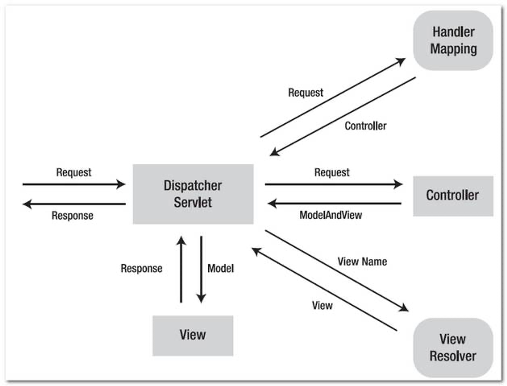
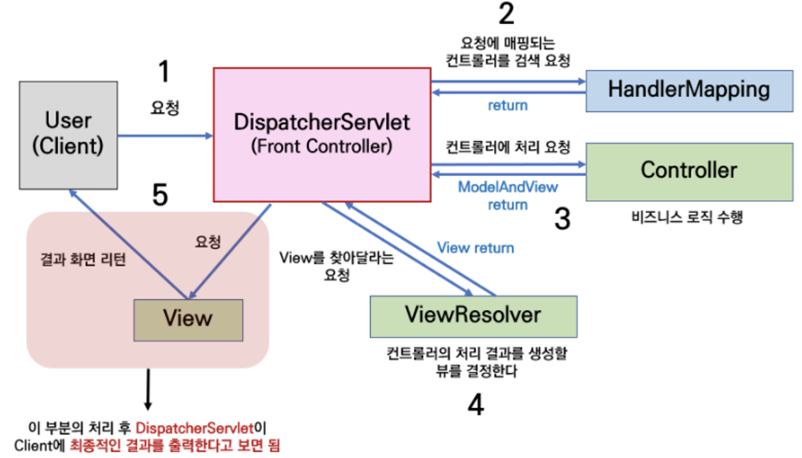
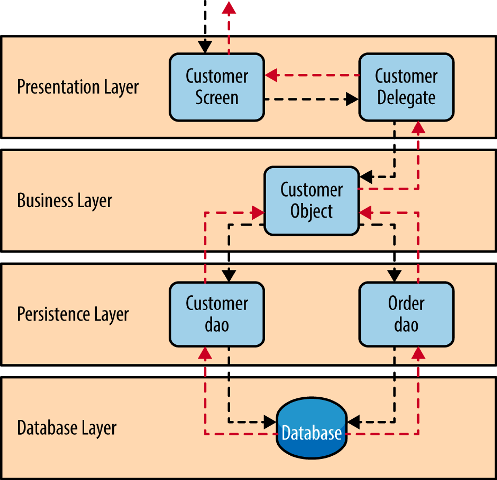
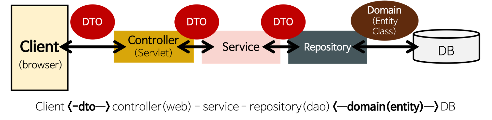

기초 백엔드 스터디 5주차
===
***
## MVC(Model-View-Controller)
> 웹 어플리케이션과 그 외의 사용자 인터페이스를 가진 어플리케이션을 설계할 때 사용되는 디자인 패턴. 
> 어플리케이션의 데이터 처리, 사용자 인터페이스, 제어 로직을 분리하여 각각의 책임을 명확하게 구분.

1. Model
    - 데이터와 비즈니스 로직(업무에 필요한 데이터 처리를 수행하는 응용 프로그램의 일부) 처리
    - 데이터베이스와의 상호 작용, 쿼리 실행, 데이터 저장 및 조화와 같은 기본적인 작업 포함
    - 변경 발생 시 관련된 View에 알림
2. View
    - 화면에 표시되는 UI(User Interface) 부분
    - 데이터 표시, 사용자와의 상호작용 등을 위한 인터페이스를 표시하는 영역
3. Controller
    - Moder과 View 사이의 중개 역할
    - 클라이언트의 요청에 대해 실제 업무를 수행하는 Moder 컴포넌트 호출, 결과를 View에 전달

### MVC의 장점
1. 분리 및 재사용 : 각 컴포넌트는 독립적이다. 즉, 각각의 컴포넌트는 의존적이지 않다.

2. 유지 보수 : 변경이 필요한 경우, 해당 컴포넌트만을 수정하면 되므로 유지 보수가 용이하다.

3. 확장성 : 새로운 컴포넌트를 생성해 새로운 기능이나 로직을 추가하기 쉽다.

### Spring MVC
스프링도 Spring MVC를 통해 MVC구조를 지원한다.

위와 같은 MVC가 진행되는 과정은 아래와 같다.

1. 클라이언트가 URL을 request(요청)하면 웹 브라우저에서 스프링으로 request가 보내진다.

2. Dispatcher Servlet이 request를 받으면, Handler Mapping을 통해 해당 URL을 담당하는 Controller를 탐색 후 찾아낸다.

3. 찾아낸 Controller로 request를 보내주고, 보내주기 위해 필요한 Model을 구성한다.

4. Model에서는 페이지 처리에 필요한 정보들을 Database에서 쿼리문을 통해 가져온다.

5. 데이터를 통해 얻은 Model 정보를 Controller에게 response(응답) 해주면, Controller는 이를 받아 Model을 완성시켜 Dispatcher Servlet에게 전달해준다.

6. Dispatcher Servlet은 View Resolver를 통해 request에 해당하는 view 파일을 탐색 후 받아낸다.

7. 받아낸 View 페이지 파일에 Model을 보낸 후 클라이언트에게 보낼 페이지를 완성시켜 받아낸다.

8. 완성된 View 파일을 클라이언트에 response하여 화면에 출력한다.

이를 구현하기 위해 개발자는 비즈니스 로직만을 작성하면 되며 나머지는 Spring에서 내부적으로 처리된다.

## Api Server 구조(Controller-Service-Repository)
### 계층 구조(Layered Architecture)
> 한 서비스를 여러 개의 논리적 계층(layer)으로 나누는 설계 패턴. 각 계층은 특정 역할과 책임을 가지며, 하위 계층에 의존하는 구조를 가진다.

### Api Server 구조(Controller-Service-Repository)

스프링을 통해 서버를 구성하면 주로 위와 같은 형식으로 구성된다.
1. Controller Layer : 클라이언트와 통신
2. Service Layer : 비즈니스 로직(서비스 로직) 실행
3. Repository Layer : DB와 통신

#### Controller Layer
Client로부터 응답을 받는 계층. 사용자의 request에 대응하는 URI와 Controller의 메소드를 매칭시킨다. 이 메소드는 해당 request에 대응하는 Service Layer의 기능을 호출해 request를 처리한다.\
Spring은 클라이언트에 view(화면)를 전달할 수 있지만 일반적으로는 서버에서 데이터를 받아 프론트 측에서 화면을 띄워준다. 그래서 Response로 view가 아닌 JSON형식의 데이터를 반환하도록 할 것이다.
* JSON : 경량의 데이터 교환 형식. 순수한 텍스트 형식이기 때문에 많은 프로그래밍 언어에서 읽고 쓸 수 있다.
   JSON 예시
   ~~~ java
   {
       "name": "John Doe",
       "age": 30,
       "isStudent": false,
       "hobbies": ["reading", "swimming", "gaming"],
       "address": {
           "street": "123 Main St",
           "city": "Springfield",
           "postalCode": "12345"
       }
   }
   ~~~
  
Controller Layer 구현 예시
~~~java
@RestController
@RequiredArgsConstructor
@RequestMapping(value = "/demo")
public class DemoController {
    private final DemoService demoService;

//    @RequestMapping(method= RequestMethod.GET, value = "/test/1/{id}")
    @GetMapping("/test/1/{id}")
    public DemoDto getAllStudents(@PathVariable Long id) {
        return demoService.getDemoEntity(id);
    }

//    @RequestMapping(method= RequestMethod.POST, value = "/test/2")
    @PostMapping("/test/2")
    public void addStudent(@RequestBody DemoDto demoDto) {
        demoService.addDemoEntity(demoDto);
    }
}
~~~
#### *어노테이션 정리*
- **@RestController** : **@ResponseBody** + **@Controller**
- **@ResponseBody** 메서드에서 반환하는 값을 HTTP 응답 body로 전송. JSON이나 XML 같은 데이터 형태를 클라이언트에게 전송할 때 유용하게 사용된다.
- **@Controller** : 해당 클래스가 Spring MVC의 컨트롤러임을 나타낸다.
---
- **@RequestMapping** : URI와 Controller 의 메소드를 매핑해준다.
- **@GetMapping** : @RequestMapping(method= RequestMethod.GET) 과 동일하다. 더 간단한 표현.
---
- **@RequestParam** : HTTP 요청 파라미터를 컨트롤러 메서드의 매개변수로 바인딩하는데 사용된다.
  - ex) /activities?id=1 에서 id=1 값을 읽을 때 사용
- **@PathVariable** : URI 패턴의 일부분을 동적으로 변수로 취급하고, 그 값을 컨트롤러 메서드의 매개변수에 바인딩한다.
  - ex) /activities/1 에서 1 값을 읽기 위해 사용
- **@RequestBody** : HTTP 요청 본문(body)의 내용을 Java 객체로 변환하거나 바인딩할 때 사용된다. 사용자로부터 입력값을 받을 때 주로 사용.
---
이를 바탕으로 위 예시를 해석해보자면
1. 위 클래스는 JSON 값을 반환하는 Controller 이다.

2. Controller클래스와 클래스 내부 메소드 모두에 **@RequestMapping**이 붙어있다면, Controller URL + method URL이 해당 메소드의 URL이다.
   - ex) getAllStudents의 URL : GET /demo/test/1/{id}

3. {id}에 해당하는 부분은 **PathVariable**을 통해 읽어들인다.

4. addStudent는 **@RequestBody**를 통해 사용자로부터 데이터를 받아 서비스 레이어로 넘겨준다.

이처럼 Controller는 사용자로부터 데이터를 입력을 받는 부분을 설정하는 역할을 한다.

#### Service Layer
실질적인 비즈니스 로직이 실행되는 계층. controller 레이어의 하위 계층으로, controller에서 매칭된 메소드가 Service 레이어의 메소드를 실행하게 된다.\
주로 repository 레이어에서 받아온 데이터를 전달받아 가공, 처리한 후 이를 controller 레이어에 넘겨준다.
~~~java
@Service
@RequiredArgsConstructor
public class DemoService {
    private final DemoRepository demoRepository;

    @Transactional
    public DemoDto getDemoEntity(Long id) {
        DemoEntity demoEntity = demoRepository.findById(id).orElseThrow(RuntimeException::new);
        return new DemoDto(demoEntity.getId(), demoEntity.getStrA(), demoEntity.getStrB());
    }

    @Transactional
    public void addDemoEntity(DemoDto demoDto) {
        DemoEntity demoEntity = new DemoEntity(demoDto.getId(), demoDto.getStrA(), demoDto.getStrB());
        demoRepository.save(demoEntity);
    }
}
~~~
DemoEntity
~~~java
@Entity
@Getter
@NoArgsConstructor(access = AccessLevel.PROTECTED)
public class DemoEntity {
   @Id
   private Long id;
   private String strA;
   private String strB;

   public DemoEntity(Long id, String strA, String strB) {
      this.id = id;
      this.strA = strA;
      this.strB = strB;
   }
}
~~~
#### Repository Layer
특정 도메인 모델에 대한 CRUD(Create, Read, Update, Delete) 연산을 캡슐화하는 레이어. DB에서 값을 가져오거나 변경할 때 이 레이어를 사용한다.
~~~java
public class DemoRepository extends JpaRepository<DemoEntity, Long>{
}
~~~

#### DTO(Data Transfer Object)
레이어가 아닌 계층간 데이터 교환을 위해 사용되는 객체이다.
- 주로 클라이언트와 서버 간 데이터 교환에 사용되며 필요한 데이터만을 포함한다
- 특별한 로직을 가지지 않는다

예시
~~~java
@Getter
public class DemoDto {
    private Long id;
    private String strA;
    private String strB;

    public DemoDto(Long id, String strA, String strB) {
        this.id = id;
        this.strA = strA;
        this.strB = strB;
    }
}
~~~

***데이터 교환을 DTO로 해야하는 이유***
1. Entity 클래스가 데이터베이스와 맞닿은 핵심 클래스이기 때문에 화면 변경과 같은 사소한 기능 변경을 위해 테이블과 연결된 Entity클래스를 변경하는 것은 불필요하다.

2. 다양한 비즈니스 로직과 요구사항에 대해 유연하게 대응할 수 있다. 각 비즈니스 로직에 맞춘 필드들만 생성함으로써 어떤 값들이 매핑되는지 쉽게 파악할 수 있고, 만약 API 설계 상황에서 필드에 다른 이름을 부여하거나 하는 상황에서도 유연하게 대처할 수 있다.

3. Controller와 Service 사이의 강한 의존을 방지하기 위해서 DTO를 사용한다. Service가 받고 싶은 파라미터가 Controller에게 종속적이게 되면 Service가 Controller 패키지에게 의존하게 된다.\
   이를 방지하기 위해 Service가 원하는 포맷에 맞춰 Controller가 DTO를 통해 그 포맷을 맞춰주는 것이다.

즉, 확장성과 보안을 위해 이를 사용하는 것이다.
