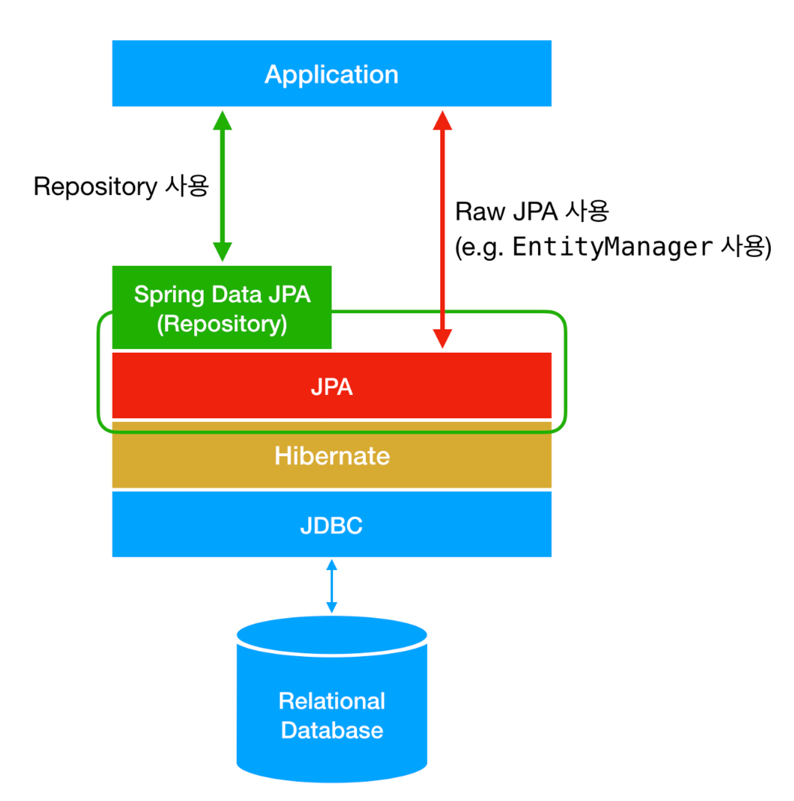
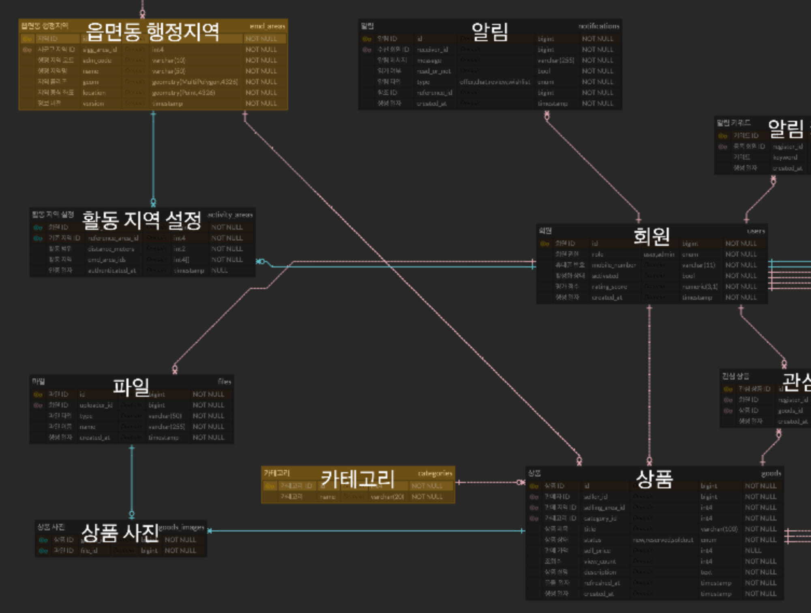
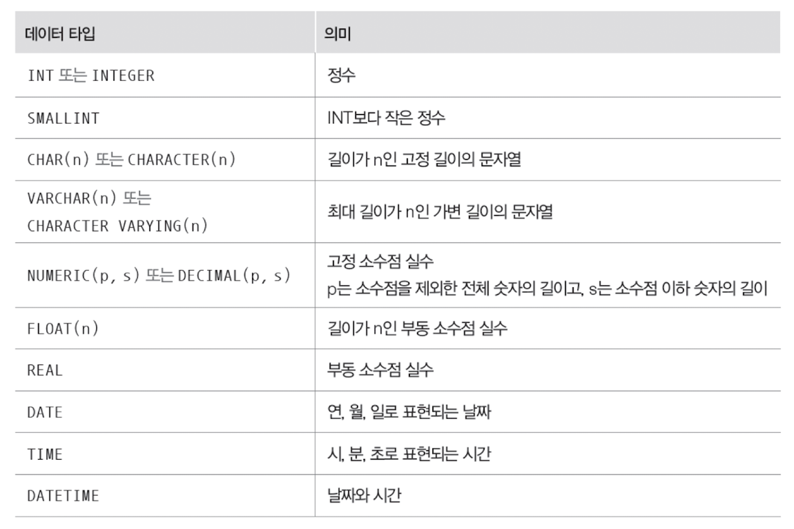
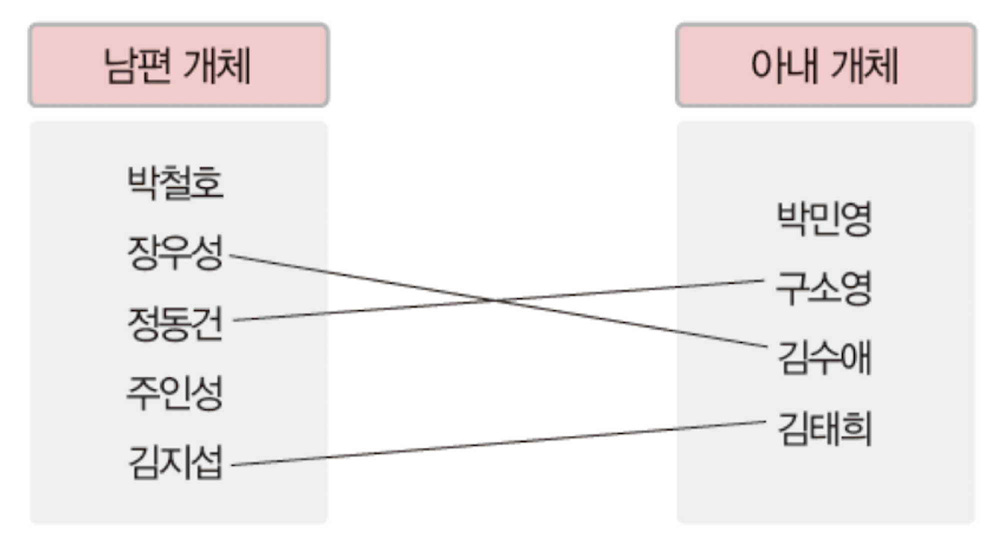
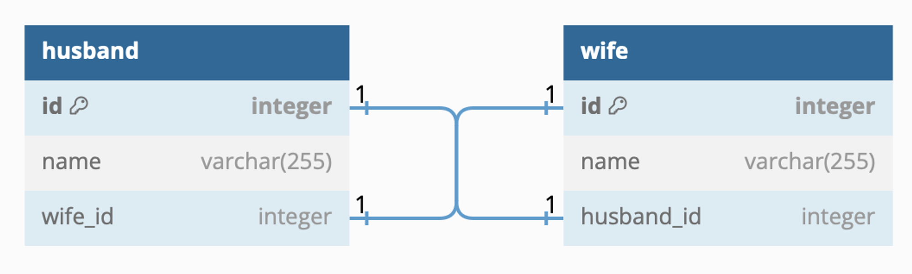
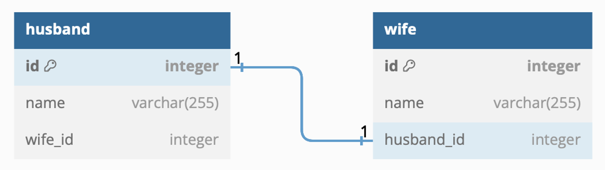
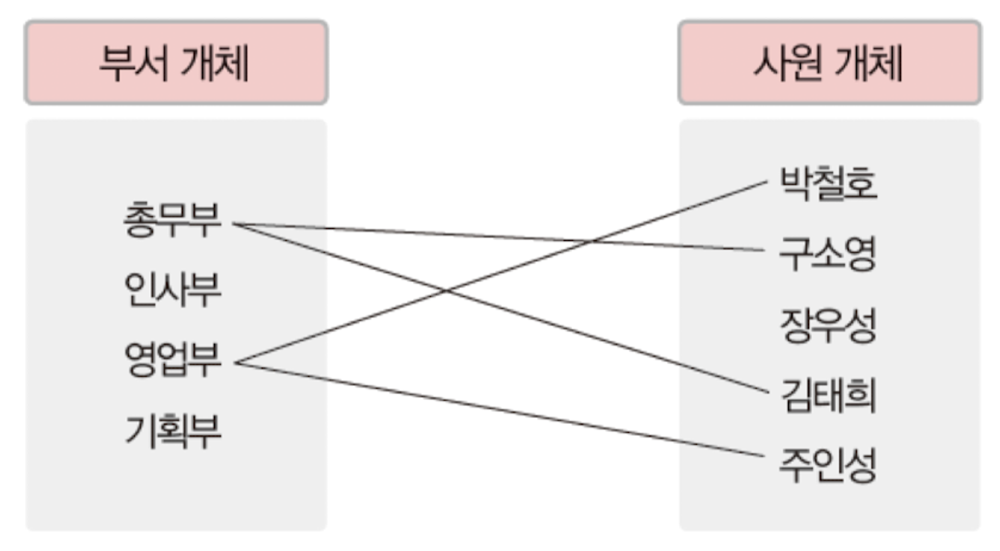
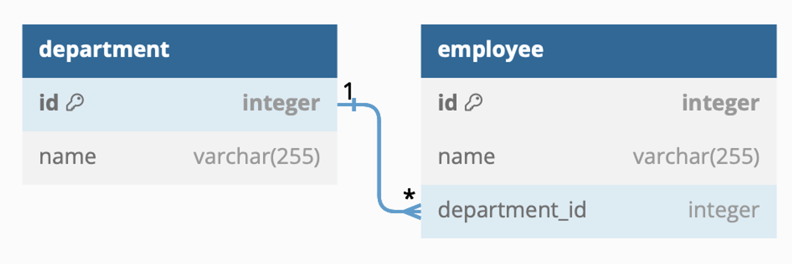
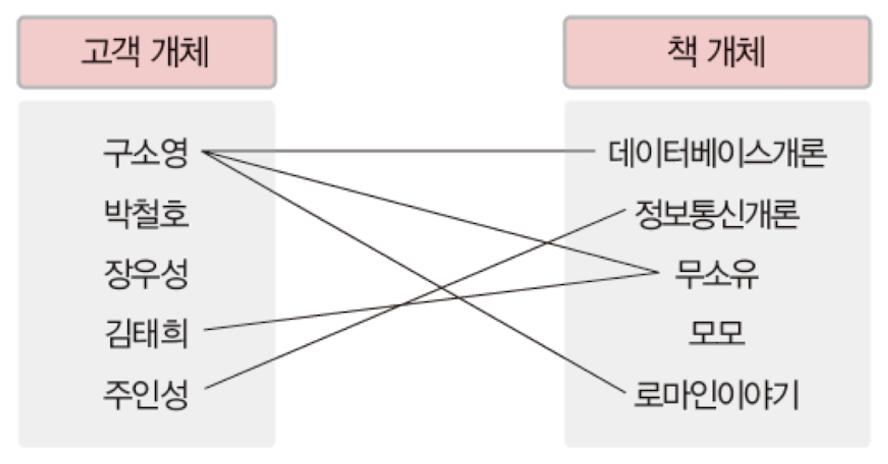
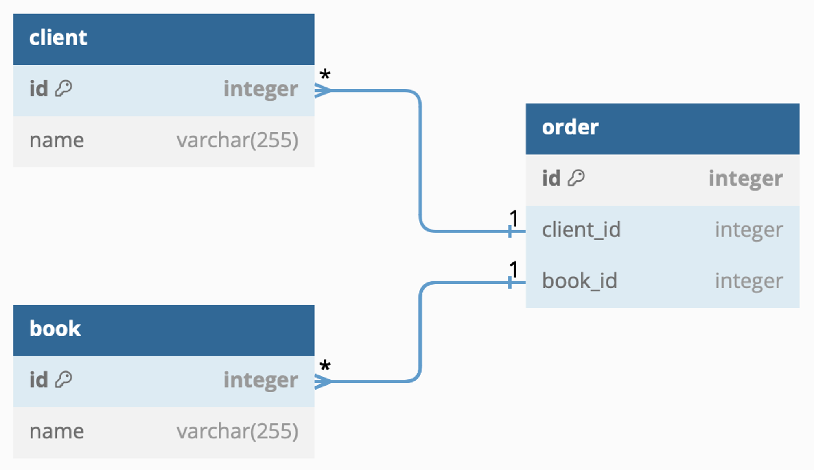

기초 백엔드 스터디 6주차
===
***
## DB(DataBase)
> 여러 사용자가 공유하여 사용할 수 있도록 통합해서 저장한 운영 데이터의 집합. 
> 다양한 자료를 저장할 수 있으며 대표적인 자료로 SQL과 NoSQL이 있다.

### SQL(Structured Query Language, 구조화 질의 언어)
흔히 RDB(Relational DataBase)라고 부른다.\
특징으로는
1. 정해진 데이터 스키마에 따라 데이터가 테이블에 저장된다.
    - 스키마를 준수하지 않은 레코드는 테이블에 추가할 수 없다.
    - 스키마(Schema) : 데이터베이스에서 자료의 구조, 자료의 표현 방법, 자료 간의 관계를 형식 언어로 정의한 구조
2. 데이터는 관계를 통해 여러 테이블에 분산된다.
3. 중복 데이터는 저장하지 않는다.
    - 무결성 보장

가 있다. 따라서 수정이 빈번하고 구조와 중요도가 높을 경우 사용하기 좋다.\
대표적인 DB로는 MySQL, MsSQL, 오라클 등이 있다.

### NoSQL
No SQL, 즉 SQL이 아닌 DB로 스키마도 없고 관계도 없는 자료 형식이다.

1. 스키마와 관계가 없는 자료 형식
2. 관련 데이터를 동일한 컬렉션에 넣는다.

이러한 특징을 가져 유연한 구조, 빠른 속도, 확장이 편리하다는 장점을 가진다.\
MongoDB, Redis 등이 NoSQL에 속한다.

## ORM(Object-Relational Mapping)
> 데이터베이스와 객체 지향 프로그래밍 언어 사이의 관계형 데이터를 객체로 매핑하는 기술 또는 프로그래밍 기술

Entity(Mapping에서 다룰 예정)를 데이터베이스의 테이터 형식으로 바꿔 저장해준다. ORM을 사용하면 SQL을 작성하지 않아도 데이터를 조작할 수 있다는 장점이 있다.\
종류로는 Hibernate(Java에서 주로 사용), EclipseLink, DataNucleus 등이 있다.

#### ORM의 장단점
- 장점
  1. **추상화** : 데이터베이스와의 상호 작용을 객체 지향적인 방식으로 처리할 수 있다.
  2. **데이터베이스 독립성** : 다양한 데이터베이스 시스템에 대해 동일한 코드를 사용할 수 있게 도와준다.
  3. **생산성** : SQL쿼리를 직접 작성하지 않아도 된다.
  4. **유지 보수** : 코드 변경이 필요할 때 객체 모델만 수정하면 된다.
- 단점
  1. **성능** : 개발자가 작성한 쿼리보다 비효율적일 수 있다.
  2. **복잡성** : 복잡한 쿼리나 특정 데이터베이스 최적화 기술을 사용하려면 ORM을 벗어나야 할 수 있다.

위와 같은 단점도 존재하지만 개발의 편의를 위해 ORM을 거의 필수적으로 사용하는 편이다.

## JPA(Java Persistence API)

- Hibernate : JPA(인터페이스)에 대한 구현체
- JDBC : 데이터베이스 연결 및 SQL 쿼리 수행을 위한 낮은 수준의 API 제공. 개발자는 SQL쿼리를 직접 작성하고 실행해야 한다. 

주로 스프링에서 많이 사용하지만, 자바 애플리케이션에서 관계형 데이터베이스를 사용하는 방법을 정의한 자바 API.\
자바 ORM 기술에 대한 표준 사양으로, 객체와 데이터베이스 테이블 간의 매핑을 처리.

특징
1. **객체-테이블 매핑** : 어노테이션 또는 XML을 사용하여 자바 객체와 데이터베이스 테이블을 매핑.

2. **쿼리 언어 사용** : JPQL(Java Persistence Query Language)이라는 객체지향 쿼리 언어를 제공하여 데이터베이스에 질의 가능.

3. **생명 주기 관리** : Entity의 생명 주기(생성, 조회, 수정, 삭제 등) 관리.

4. **캐싱** : 기본적인 캐시 전략 지원

5. **자동 스키마 생성** : 데이터베이스 스키마를 자동으로 생성하거나 업데이트.

JPA는 위와 같은 영속성 컨테스트(Entity를 영구 저장하는 환경)를 이용하여 구현한다.

### Mapping
#### Entity
`데이터베이스의 테이블`과 `자바 클래스`를 매핑하는 역할.\
엔티티 클래스(`@Entity`)는 데이터베이스 테이블의 레코드를 객체로 표현하며, JPA를 사용하여 이 객체를 관리할 수 있다.\
아래는 Entity의 한 예시이다.
~~~java
@Entity // 해당 클래스는 JPA가 관리하는 엔터티로 표시되며, 데이터베이스 테이블과 연동될 수 있게 됨
@NoArgsConstructor(access = AccessLevel.PROTECTED)
public class Member {
    @Id
    @GeneratedValue(strategy = GenerationType.IDENTITY) // 이 값이 기본키 임을 나타냄
    private Long id;

    @OneToMany(fetch = FetchType.LAZY)
    private List<Feed> feeds;

    private String name;
}
~~~
실제 서비스에는 무수히 많은 Entity가 존재하고, Entity들간의 관계를 기반으로 다양한 정보를 저장한다. 이를 위해 **ERD(Entity-Relation Diagram)** 을 사용하며, 이 내용을 기반으로 객체를 구현한다. ERD에는 데이터베이스의 구조에 관한 메타 데이터, 명세를 적어둔다.\
아래는 ERD의 예시이다.

DB에서 데이터의 자료형은 Java의 자료형과 다른 자료형을 사용한다. JPA가 알맞은 자료형으로 바꿔주지만 이를 알고 있어야 ERD를 만들 수 있다.

#### 객체간의 관계
객체는 다른 객체와 아래와 같은 관계를 맺을 수 있다.
1. 1 : 1
2. 1 : M
3. M : N

- **1:1 관계**
    
    
    각 개체가 하나의 개체와만 관계를 가질 수 있는 관계. `@OneToOne` 사용
  1. 양방향 접근
  
    ~~~java
    @Entity
    @NoArgsConstructor(access = AccessLevel.PROTECTED)
    public class Husband {
        @Id
        @GeneratedValue(strategy = GenerationType.IDENTITY)
        private Long id;
    
        @OneToOne
        private Wife wife;
    
        private String name;
    }
    ~~~
    ~~~java
    @Entity
    @NoArgsConstructor(access = AccessLevel.PROTECTED)
    public class Wife {
        @Id
        @GeneratedValue(strategy = GenerationType.IDENTITY)
        private Long id;
    
        @OneToOne
        private Husband husband;
    
        private String name;
    }
    ~~~
  2. 단방향 접근
  
    ~~~java
    @Entity
    @NoArgsConstructor(access = AccessLevel.PROTECTED)
    public class Husband {
        @Id
        @GeneratedValue(strategy = GenerationType.IDENTITY)
        private Long id;
    
        private String name;
    }
    ~~~
    ~~~java
    @Entity
    @NoArgsConstructor(access = AccessLevel.PROTECTED)
    public class Wife {
        @Id
        @GeneratedValue(strategy = GenerationType.IDENTITY)
        private Long id;
    
        @OneToOne
        private Husband husband;
    
        private String name;
    }
    ~~~
  Husband클래스에 `@OneToOne`이 빠진 것을 볼 수 있다.\
  또한 위 코드에서는 객체 안에 객체가 속성으로 들어가있지만 ERD에는 객체의 id값만 존재하는 것을 볼 수 있는데,
  이는 DB에는 객체가 한 속성으로서 저장될 수 없기 때문에 객체의 키 값을 저장하여 객체와의 관계를 표시하는 것이다.

- **1 : N 관계**

  ~~~java
  @Entity
  @NoArgsConstructor(access = AccessLevel.PROTECTED)
  public class Department {
      @Id
      @GeneratedValue(strategy = GenerationType.IDENTITY)
      private Long id;
  
      @OneToMany(fetch = FetchType.LAZY)
      private List<Employee> employees;
  
      private String name;
  }
  ~~~
  ~~~java
  @Entity
  @NoArgsConstructor(access = AccessLevel.PROTECTED)
  public class Employee {
      @Id
      @GeneratedValue(strategy = GenerationType.IDENTITY)
      private Long id;
  
      @ManyToOne
      private Department department;
  
      private String name;
  }
  ~~~
  1에 해당하는 부분(부서)에 `@OneToMany`, N에 해당하는 부분(사원)에 `ManyToOne`을 사용한다.\
  
  만약 Department(부서)에서 Employee(사원)으로의 접근이 필요하지 않다면
  ~~~java
  @Entity
  @NoArgsConstructor(access = AccessLevel.PROTECTED)
  public class Department {
      @Id
      @GeneratedValue(strategy = GenerationType.IDENTITY)
      private Long id;
  
      private String name;
  }
  ~~~
  Department클래스의 `@OneToMany`부분을 제거함으로써 단방향 접근으로 구현할 수 있다.

- **M : N 관계**

  ~~~java
  @Entity
  @NoArgsConstructor(access = AccessLevel.PROTECTED)
  public class Book {
      @Id
      @GeneratedValue(strategy = GenerationType.IDENTITY)
      private Long id;
  
      @ManyToMany
      private List<Book> books;
  
      private String name;
  }
  ~~~
  ~~~java
  @Entity
  @NoArgsConstructor(access = AccessLevel.PROTECTED)
  public class Client {
      @Id
      @GeneratedValue(strategy = GenerationType.IDENTITY)
      private Long id;
  
      @ManyToMany
      private List<Client> clients;
  
      private String name;
  }
  ~~~
  `@ManyToMany`를 사용하여 구현한다.\
  하지만
  1. 매핑 정보는 넣을 수 있지만 추가 정보는 넣을 수 없다.
  2. 중간 테이블이 숨겨져 있어 예상치 못한 쿼리들이 나간다.
  
  와 같은 문제점들 때문에 실무에서 쓰기엔 부적합하다.
  연결 테이블용 엔티티를 추가하여 `M : 1`과 `1 : N` 관계로 분해해 이러한 문제점을 극복할 수 있다.
  
  ~~~java
  @Entity
  @NoArgsConstructor(access = AccessLevel.PROTECTED)
  public class Order {
      @Id
      @GeneratedValue(strategy = GenerationType.IDENTITY)
      private Long id;
      
      @ManyToOne(fetch = FetchType.LAZY)
      private Client client;
      
      @ManyToOne(fetch = FetchType.LAZY)
      private Book book;
  }
  ~~~
  ~~~java
  @Entity
  @NoArgsConstructor(access = AccessLevel.PROTECTED)
  public class Book {
      @Id
      @GeneratedValue(strategy = GenerationType.IDENTITY)
      private Long id;
  
      @OneToMany
      private List<Order> orders;
  
      private String name;
  }
  ~~~
  ~~~java
  @Entity
  @NoArgsConstructor(access = AccessLevel.PROTECTED)
  public class Client {
      @Id
      @GeneratedValue(strategy = GenerationType.IDENTITY)
      private Long id;
  
      @OneToMany
      private List<Order> orders;
  
      private String name;
  }
  ~~~
  위와 같이 구현할 경우 Book : Order : Client가 M : 1 : N 관계가 된다.

### Spring Data JPA
> Spring Framework의 일부로, 데이터 접근 계층을 쉽게 구현할 수 있도록 지원하는 모듈.
JPA 를 기반으로 하여 다양한 기능을 제공한다.

특징
1. Repository 인터페이스 : Repository 인터페이스를 사용하여 CRUD (Create, Read, Update, Delete) 연산을 추상화한다. 개발자는 이 인터페이스를 상속받아 필요한 메서드를 선언하기만 하면 된다.
2. 쿼리 메서드 : 메서드 이름을 분석하여 자동으로 SQL 쿼리를 생성하는 기능을 제공한다.
3. Custom Query : `@Query`를 사용하여 사용자 정의 쿼리를 작성할 수 있다.
4. Pagination and Sorting : 페이징과 정렬 기능을 지원한다.
5. Transaction Management : 트랜잭션을 쉽게 관리할 수 있게 해줍니다.

JPA를 사용했을 때
~~~java
public static void main(String[] args) {
        EntityManagerFactory emf = Persistence.createEntityManagerFactory("hello");
        EntityManager em = emf.createEntityManager();
        EntityTransaction tx = em.getTransaction();
        tx.begin();
        try {
            Team team = new Team();
            team.setName("팀A");
            em.persist(team);

            em.flush();
            em.clear();
            tx.commit();
        } catch (Exception e){
            tx.rollback();
        } finally {
            em.close();
        }
        emf.close();
    }
~~~
Spring Data JPA를 사용했을 때
~~~java
public interface UserRepository extends JpaRepository<User, Long> {

    List<User> findByUsername(String username);

    @Query("SELECT u FROM User u WHERE u.email = email")
    User findByEmail(String email);
}
~~~
